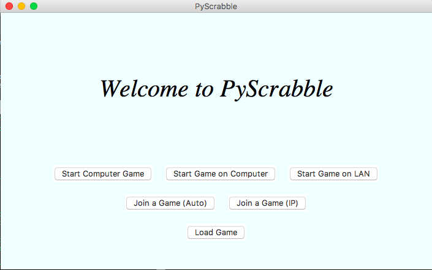
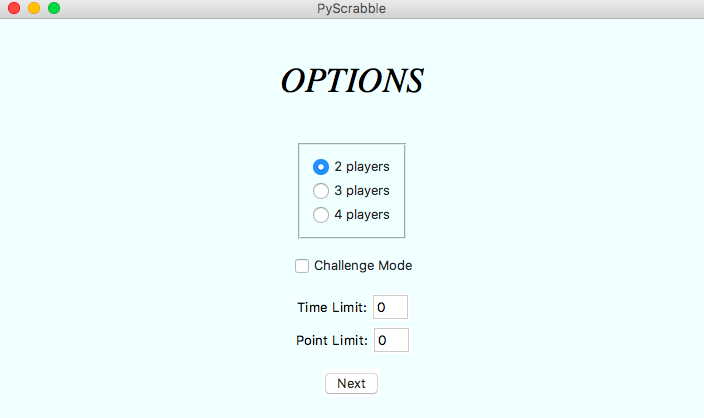
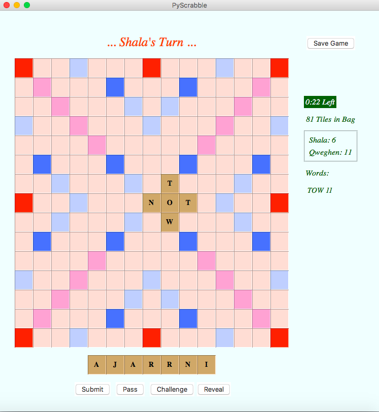

# PyScrabbleGUI

A complete scrabble game written in Python3 with the following features:

* challenge mode
* time limit
* point limit
* multiplayer on a single computer
* multiplayer over LAN
* playing against computer

You can choose different options from the game interface.

If you don't know how to play Scrabble, click [here](https://scrabble.hasbro.com/en-us/rules) for rules

Clone the game and enjoy it. If you have any feedbacks, I will very much appreciate.

## How to Play

### Start a game

`cd` into py_scrabble_gui folder and run `python3 py_scrabble.pyw`.

Windows users can double click on `py_scrabble.pyw`.

Unix-based OS users can make the file executable by running `chmod +x py_scrabble.pyw`.

### Blank tile

Simply place a blank tile on the spot of the letter you want to replace it with. When you submit your word, a popup will ask you what letter it should be replaced with.

### Challenge mode

The challenge mode is according to the double challenge rule. When activated, a player can challenge the words that the player before him or her has placed on the board. If one of the words is not valid, the previous player's turn will be passed and word points will be subtracted. If the words are valid, the turn of the player who has challenged will be passed.

### Multiplayer on a single computer

A game of 2, 3 or 4 players can be played on a single computer. The letters on the racks of the players will be concealed to prevent other players to see other players' letters unintentionally. By clicking the _reveal_ button, letters become visible. It is shown in red font above the board whose turn it is.

### Playing against computer

Computer goes through permutations of letters on its rack and picks the valid move with the most points. A turn for computer takes about 1 minute 30 seconds (on i5 1.6 GHz with 8 GB RAM) depending on the computer.

### Save a game

If a game is saved during a LAN multiplayer game, it can be later loaded as a normal multiplayer game on a single machine.

### Multiplayer on LAN

LAN multiplayer games aren't supported on networks which can assign more than 256 IP addresses (campus wifi and such). It might work if only the last part of the assigned IPs changes. If other parts of the IP addresses also change, hosted games will not be found.

It is better to start a LAN game on a trusted network like a home or work network because security settings might prevent remote access on some systems.

If a players on an OS X machine wants to join a game on LAN, it is recommended to increase the size of open files. The limit is 256 on new versions and it will cause `OSError: [Errno 24] Too many open files` because _Join a LAN Game_ uses threads to scan all the available IP's on LAN. In order to increase the limit, use `ulimit -n <new_limit>`. Anything above 300 should suffice.

## Screenshots

## License

This software is licensed under the [GNU General Public License 3.0](https://www.gnu.org/licenses/gpl-3.0.txt).